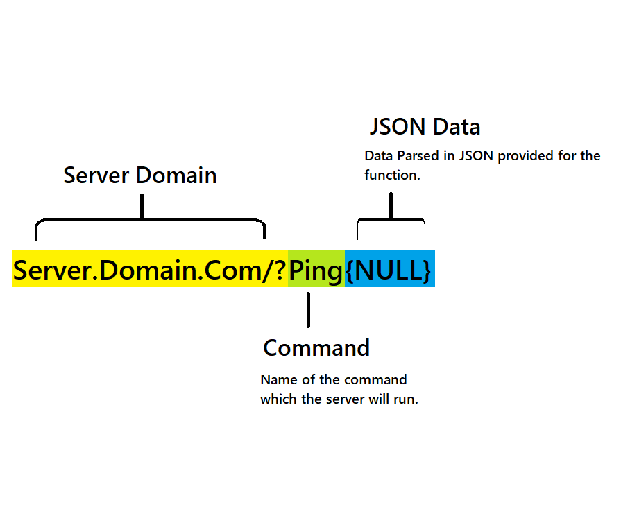

## Server Call Documentation
### How API calls work:
A call is made up of 3 parts:

#### The Server Domain
This is the link to the server with a question mark at the end to run a query.
#### Command
This is the command that the server will read and then execute.
Full list of commands in Client-Development.md
#### JSON Data
JSON Data needed to execute the command.